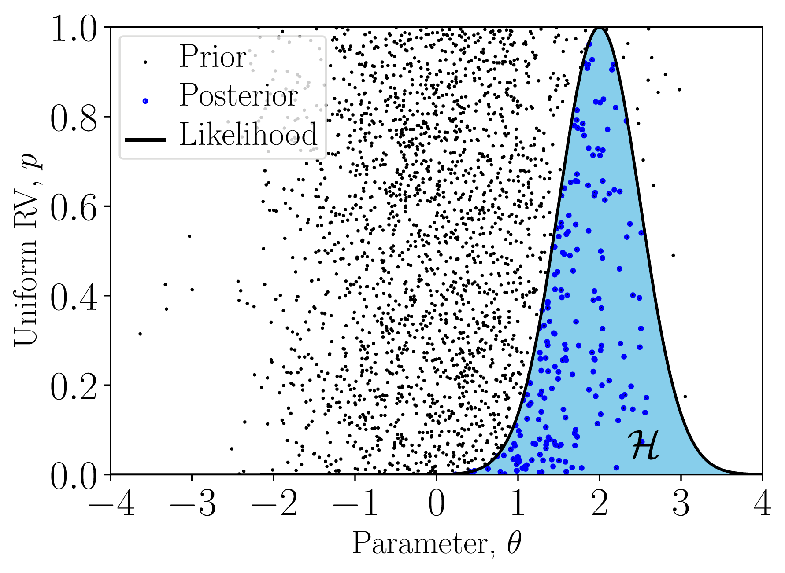
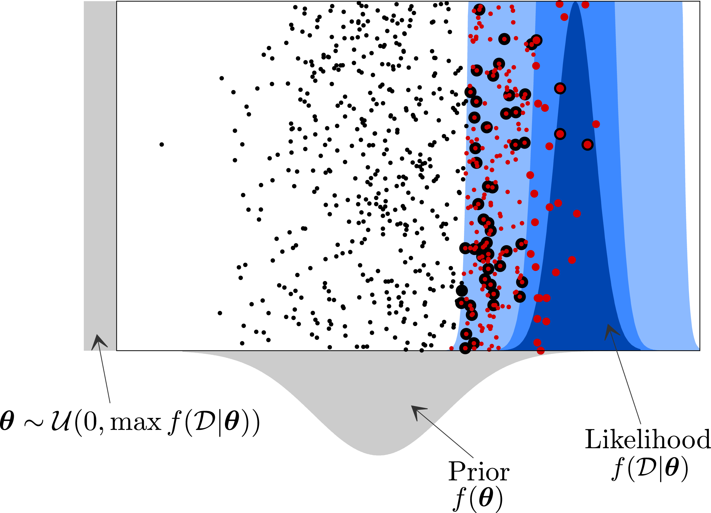
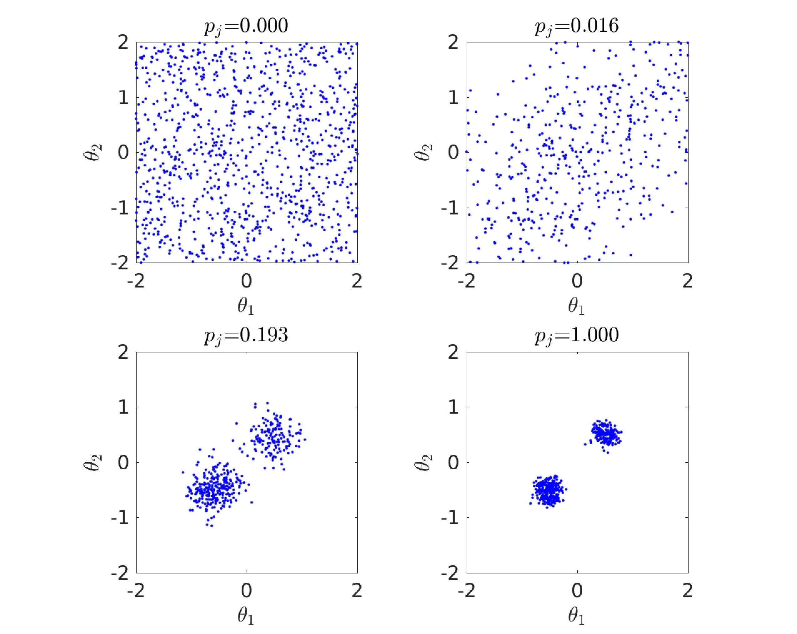
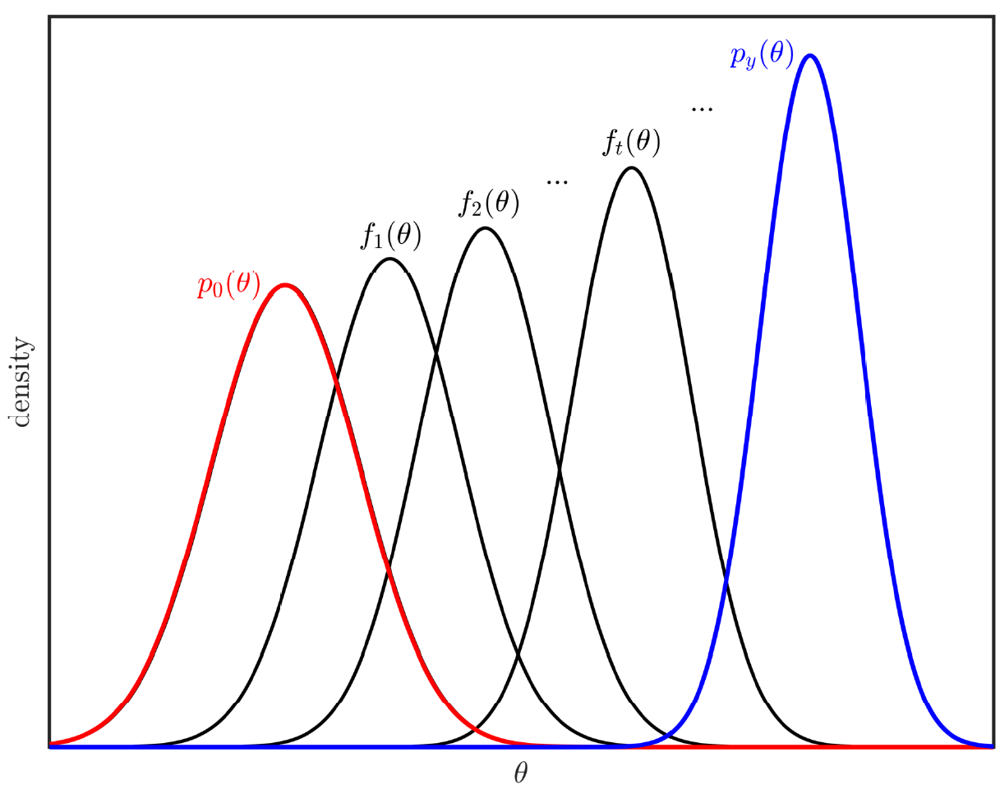

# Bayesian Inference Tools

This page collects software tools for sampling-based Bayesian inference.

We provide 3 benchmark problems which is described in the [examples file](./Bayesian_inference_examples.pdf).

## 1. BUS

MATLAB and Python 3 software tools for Bayesian inference with BUS (Bayesian Updating with Structural reliability methods) combined with Subset Simulation.
         

## 2. Adaptive BUS

MATLAB and Python 3 software tool for Bayesian inference with the adaptive version of BUS with Subset Simulation.
         

## 3. Improved TMCMC

MATLAB and Python 3 software tool for Bayesian inference with the improved TMCMC method.
         

## 4. SMC

MATLAB and Python 3 software tool for Bayesian inference with the sequential Monte Carlo (SMC) method.
  

## 5. CEBU

MATLAB and Python 3 software tool for Bayesian inference with the Cross-entropy Bayesian Update (CEBU) method.

