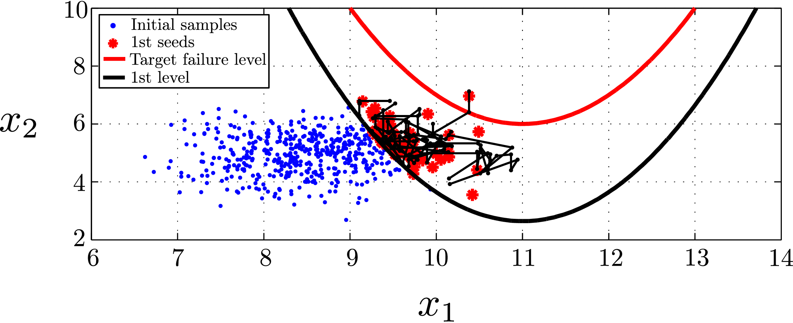
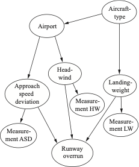

# Software overview

Hey there! This is the official Github repo of the Engineering Risk Analysis (ERA) Group of the Technical University of Munich (TUM).
For more about us and our work information, please visit our [website](https://www.cee.ed.tum.de/era/era-group/).

You find here a series of free software tools developed in our group, which can be used for teaching and research activities.

The software is provided "as is" without warranty of any kind.

If you encounter any issues or bugs in the code, feel free to reach out to us under [code.era@ed.tum.de](code.era@ed.tum.de).

This page here will be populated with all folders, so you can download all files at once. In the future, this page will also serve as the main directory, which provides the links to the respective submodules, where the individual codes can be retrieved.

## ERADist

MATLAB and Python 3 classes for the convenient definition and use of probability distributions. It allows defining the joint distribution through the marginal distributions and correlation coefficients. The Nataf transformation (Gaussian copula) is then used to construct the joint distribution.

The distributions can be defined through their parameters, through their moments or through data fitting.

## Surrogate Modelling

Tools for uncertainty quantification with surrogate models. Includes:

- Partial-Least-Square-Based Polynomial Chaos Expansion (PLS-PCE)

## Reliability Analysis Tools

A set of tools for reliability analysis and estimation of rare event probabilities. Includes:

- First-Order Reliability Method
- Cross Entropy (CE) Method and Improved CE (iCE) Method
- Subset Simulation
- Sequential Importance Sampling
- Combination Line Sampling

## Bayesian Inference Tools

A set of tools for sampling-based Bayesian inference. Includes: 

- Bayesian Updating with Structural reliability methods (BUS)
- Adaptive BUS
- Improved Transitional Markov Chain Monte Carlo (iTMCMC)
- Sequential Monte Carlo
   

## Bayesian network discretization of reliability problems

A MATLAB based software prototype performing efficient static discretization  
for structural reliability problems, such that they can be updated in a  
discrete Bayesian network framework.
    

## Risk Analysis Tool (RAT)

“RAT” is an Excel based tool for scenario-based risk assessment and for Cost Benefit Analysis (CBA) of alternative risk mitigation strategies. It consists of three modules: (1) Risk estimation, (2) Cost estimation and (3) Evaluation of strategies using CBA. It is applicable for problems related to natural hazards such as floods as well as other types of hazards for which the risk is assessed through scenarios representing varying magnitudes of the hazard. Results are presented in tables and figures that can directly be used in reports and presentations. A comprehensive documentation of the methodology utilised in RAT and illustrative examples are also provided. 

## Fesslix

Fesslix is an application to perform stochastic analysis (e.g. reliability analysis and Bayesian updating). The source code is written in C++ and is available free of charge. Fesslix comes with a powerful and flexible input language that allows coupling of almost any model (external application) to Fesslix.
     
