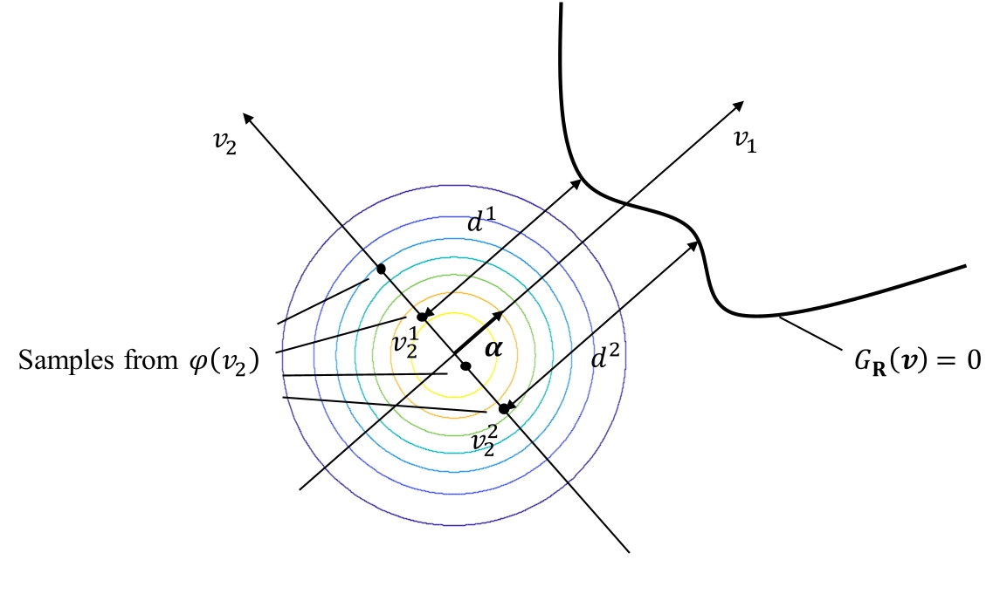

# Reliability Analysis Tools

This page collects software tools for reliability analysis

We provide a list of 6 **benchmark problems** which are described in [this document](./reliability_examples.pdf).

## [1. First-Order Reliability Method](1.%20First-Order%20Reliability%20Method/)

MATLAB and Python 3 software tools for reliability assessment using the First-Order Reliability Method. The optimization problem is solved by the Hasofer-Lind-Rackwitz-Fiessler (HLRF) algorithm and standard optimization libraries.

        

## [2. Cross-Entropy Method and Improved Cross Entropy Method](2.%20Cross%20Entropy%20Method%20and%20Improved%20Cross%20Entropy%20Method/)

MATLAB and Python 3 software tools for reliability assessment using the cross entropy method (CE) and the improved cross entropy method (iCE) to find an importance sampling (IS) density. Different parametric distribution families are available to be chosen from (single Gaussian (SG), Gaussian mixture (GM), von Mises-Fisher-Nakagami mixture (vMFNM)).

      

## [3. Subset Simulation](3.%20Subset%20Simulation/)

MATLAB and Python 3 software tools for reliability assessment with Subset Simulation that includes an implementation of the adaptive Conditional Sampling approach for MCMC sampling conditional on intermediate failure events.

      

## [4. Sequential Importance Sampling](4.%20Sequential%20Importance%20Sampling/)

MATLAB and Python 3 software tools for reliability assessment with Sequential Importance Sampling that includes an implementation of adaptive Conditional Sampling and Metropolis-Hastings with Gaussian mixture proposal for the MCMC sampling.

      

## [5. Combination Line Sampling](5.%20Combination%20Line%20Sampling/)

A MATLAB and Python 3 software for the computation of rare event probabilities for reliability assessment using the combination line sampling (CLS) approach. 

      

