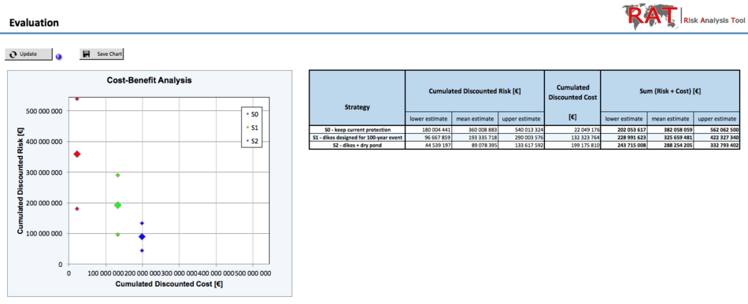
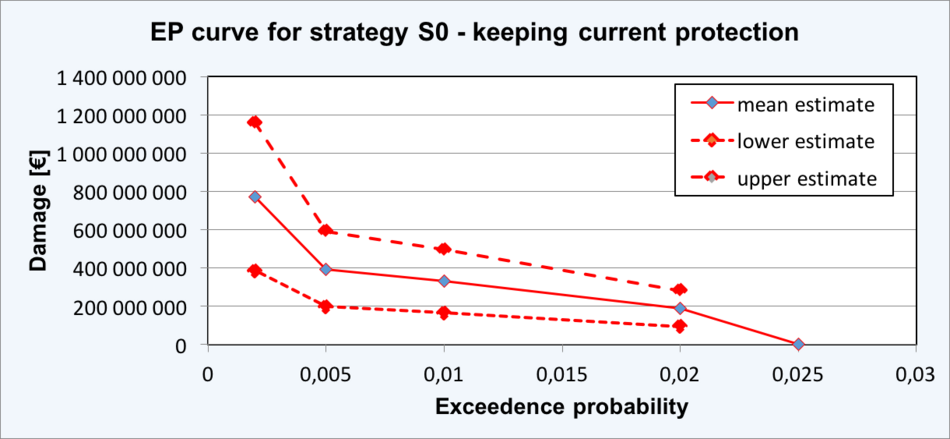
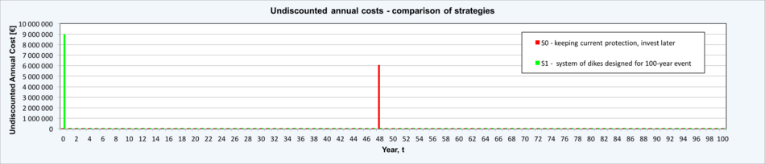

# Risk Analysis Tool (RAT)

## Scenario-based risk assessment and cost-benefit analysis

The purpose of the Microsoft Excel based “RAT” tool is to support users with quantitative risk analyses for natural hazards and with the evaluation of alternative risk mitigation strategies using Cost Benefit Analysis (CBA). It is also applicable to other types of hazards for which the risk is assessed through scenarios corresponding to varying magnitudes of the hazard. Results are presented in tables and figures that can directly be used in reports and presentations.
  

  

The RAT tool includes the following 3 modules:

* Risk estimation – In the risk estimation module of RAT, the risk (defined as expected annual damage/loss caused by the hazard) is approximated using multiple scenarios representing different magnitudes of the hazard event. The scenarios are characterized by their exceedance probabilities (or corresponding return periods such as 100-year event, 300-year event etc.). The risk estimation is done separately for all alternative risk mitigation strategies. RAT calculates the Net Present Value (NPV) of risk over the defined planning horizon. RAT also provides additional features in the risk estimation module which can be used when relevant:
    - To account for the uncertainty in the risk estimation, RAT enables to enter lower, mean and upper estimate of the expected damages per scenario.
    - RAT enables the inclusion of so-called subscenarios when estimating the expected damage for selected scenarios. With the subscenarios, one can represent different developments of hazard scenarios (such as initiation of secondary hazard events or failure of critical infrastructure).
    - RAT Lite additionally allows considering changes of risk in time, e.g. due to climate change, or due to changes in damage potential associated with socio-economic development.

  

* Cost estimation – The RAT cost estimation module serves for planning all costs associated with implementation, operation and maintenance of a risk mitigation strategy. They can be implemented as one-time costs (e.g. investment costs, reconstruction costs) or continuous costs (e.g. annual maintenance costs). RAT calculates the Net Present Value (NPV) of cost over the defined planning horizon.

  

  

* Evaluation of alternative mitigation strategies using CBA – The evaluation module of RAT compares the discounted lifetime risk and cost of alternative risk mitigation strategies and identifies the strategy that minimizes the sum of discounted risk and costs over the planning horizon.

The risk mitigation strategies can represent alternative protection measures, if the aim is to choose the best protection measure among them (e.g. the choice between dike and flood wall) or alternative combinations of protection measures, if the aim is to identify the best combination of protection measures (e.g. system of dikes vs. system of dikes with a dry pond). Note that the same type of measure (e.g. dike) with different dimensions (e.g. height of the dike) is to be considered as different protection strategies in the analysis.

To maintain the simplicity and generality of the software, RAT does not provide any support for estimation of damage for individual scenarios and for determining the costs of risk mitigation strategies. RAT should therefore be combined with appropriate physical models of the hazard events, relevant damage models and cost assessments.

## Requirements

**RAT Full** is an Excel based program using Macros. It requires MS Office version 2013 or newer for Windows OS. Macros are not fully supported in MS Office package for Mac so the software does not have full functionality on this OS.

**RAT Lite** is a simple Excel sheet NOT using Macros, with predefined formats, formulas and charts. RAT Lite might require more modifications when using for specific projects (with different number of evaluated strategies, scenarios etc.) but it provides the user more flexibility in editing than the RAT Full version.

## Documentation

The following documentation is available:

* [RAT - Methodology](./doc_files/RAT-Methodology.pdf) - provides a comprehensive description of the methodology for Risk Analysis and Cost Benefit Analysis as used in the RAT software
* [RAT - Examples](./doc_files/RAT-Examples.pdf) - provides different examples of Risk Analysis and Cost Benefit Analysis solved using RAT.
* [RAT - Manual](./doc_files/RAT-Manual.pdf) - is a short user manual for utilization of RAT Full.

